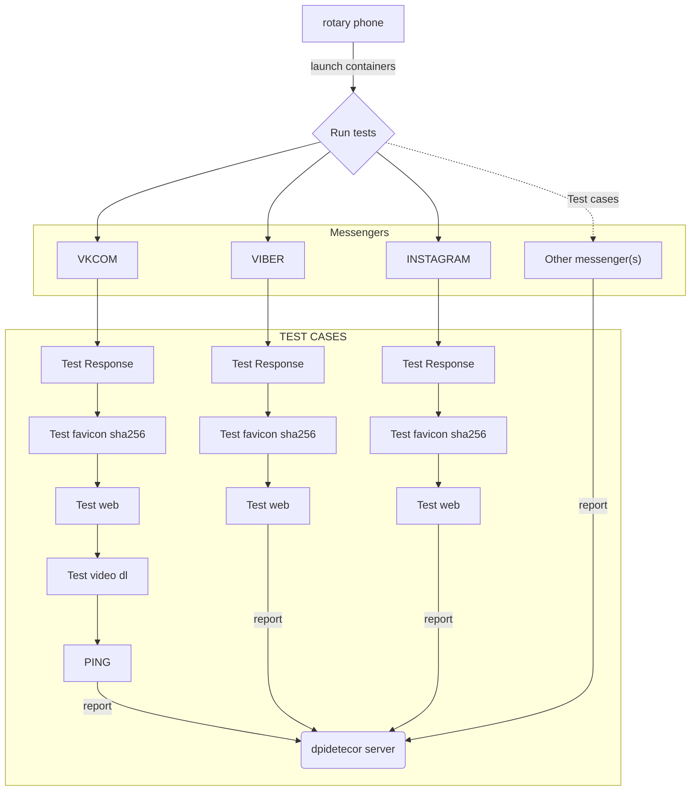

# rotary phone

Прототип модулей для анализа блокировок мессенджеров.

> один мессенджер == 1 контейнер

## Demo

https://github.com/nomah4/ubiquitous-rotary-phone/assets/59173419/62483727-b132-4be2-8628-827366057059

## schema



## Реализовано

- discord
  - тест  web
  - тест скачивания видео
- facebook
  - тест web
- instagram
  - тест web
- signal
  - web тест
- telegram
  - web тест
  - тест скачивания видео
- viber
  - web тест
- vk
  - web тест
  - тест скачивания видео
- whatsapp
  - web тест
- youtube
  - web тест
  - тест скачивания видео
  - тест доступа к thumbnail канала

## usage
тест мессенджеров (без скачивание видео)
```shell
docker-compose up

```
тест с скачиванием видео. Требуется python, yt-dlp

```shell
pip install yt-dlp
```

```shell
# docker without access root
sudo ./run_compose_a_video.sh
```
